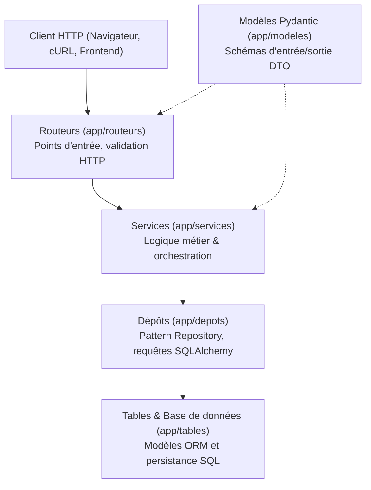

# API Catalogue de Jeux 🎮

API REST de gestion d'une collection et d'un catalogue de jeux vidéo, construite avec **FastAPI**, **SQLAlchemy** et **Pydantic**.

---

## Sommaire
- [Prérequis](#prérequis)
- [Démarrage rapide](#démarrage-rapide)
- [Configuration](#configuration)
- [Utilisation](#utilisation)
- [Tests et qualité](#tests-et-qualité)
- [Architecture](#architecture)
- [Contribuer](#contribuer)

---

## Prérequis

- **Python** : version 3.10 ou supérieure (testé sous Python 3.11 et 3.12)
- **Git**
- **Base de données** : SQLite (inclus avec Python, idéal pour le développement local) ou PostgreSQL (pour la production / Docker)

---

## Démarrage rapide

### 1. Cloner le dépôt et se positionner dans le dossier

```bash
git clone https://github.com/Michi-esc/api-jeux-Michael-Lydia.git
cd api-jeux-Michael-Lydia
```

### 2. Créer et activer l'environnement virtuel

- **Sous Windows (PowerShell)** :
  ```powershell
  python -m venv .venv
  .venv\Scripts\Activate.ps1
  ```
- **Sous Linux / macOS** :
  ```bash
  python3 -m venv .venv
  source .venv/bin/activate
  ```

### 3. Installer les dépendances

```bash
pip install -r requirements.txt -r requirements-dev.txt
```

### 4. Configurer les variables d'environnement

Copiez le fichier d'exemple pour initialiser votre configuration :
```bash
cp .env.example .env
```
*(Sous Windows PowerShell : `Copy-Item .env.example .env`)*

> [!TIP]
> Pour un démarrage immédiat sans serveur PostgreSQL externe, modifiez la variable `DATABASE_URL` dans votre fichier `.env` :
> ```dotenv
> DATABASE_URL=sqlite:///./jeux.db
> CLE_SECRETE=ma-cle-secrete-de-developpement-locale
> ```

### 5. Initialiser et peupler la base de données

Exécutez le script d'initialisation pour créer les tables et injecter les jeux et utilisateurs de base :
```bash
python scripts/peupler.py
```
*Un compte administrateur est créé par défaut (`admin@example.com` / `motdepasse123`).*

### 6. Lancer le serveur d'API

```bash
fastapi run app/main.py --port 8000
```
*(ou en mode rechargement à chaud pour le développement : `fastapi dev app/main.py`)*

### Résultat attendu

Le terminal affiche les journaux de démarrage :
```text
INFO:     Démarrage — environnement : developpement
INFO:     Base de données joignable
INFO:     Uvicorn running on http://127.0.0.1:8000 (Press CTRL+C to quit)
```
Rendez-vous sur [http://localhost:8000/docs](http://localhost:8000/docs) pour explorer la documentation interactive Swagger.

---

## Configuration

L'application utilise `pydantic-settings` via le fichier `app/config.py`. Les variables sont chargées depuis le fichier `.env` ou les variables d'environnement du système :

| Variable | Rôle | Obligatoire | Valeur par défaut |
|---|---|:---:|---|
| `DATABASE_URL` | Chaîne de connexion à la base de données (SQLite ou PostgreSQL) | **Oui** | *(Aucune)* |
| `CLE_SECRETE` | Clé secrète cryptographique servant à signer les jetons d'accès JWT | **Oui** | *(Aucune)* |
| `ALGORITHME_JETON` | Algorithme cryptographique pour la signature des jetons JWT | Non | `"HS256"` |
| `DUREE_JETON_MINUTES` | Durée de validité d'un jeton d'authentification en minutes | Non | `30` |
| `ORIGINES_AUTORISEES` | Liste des URLs clientes autorisées pour le partage de ressources CORS | Non | `["http://localhost:5173"]` |
| `ENVIRONNEMENT` | Environnement d'exécution (`developpement` ou `production`) | Non | `"developpement"` |
| `NIVEAU_JOURNAL` | Niveau de journalisation minimum (`DEBUG`, `INFO`, `WARNING`, `ERROR`) | Non | `"INFO"` |
| `ECHO_SQL` | Active l'affichage des requêtes SQL brutes exécutées par SQLAlchemy | Non | `false` |
| `MAX_TENTATIVES_CONNEXION` | Nombre maximal de tentatives de connexion échouées avant verrouillage | Non | `5` |
| `FENETRE_TENTATIVES_MINUTES` | Durée de la fenêtre temporelle de surveillance des tentatives de connexion | Non | `15` |

---

## Utilisation

L'ensemble des points d'entrée de l'API est préfixé par `/api/v1`.

### 1. Contrôle de santé (Health Check)
Vérifie que l'API est opérationnelle :
```bash
curl -X GET http://localhost:8000/api/v1/systeme/sante
```
**Réponse attendue (200 OK)** :
```json
{"statut": "operationnel"}
```

### 2. Consulter le catalogue des jeux
Lister les jeux avec un filtre sur la note minimale :
```bash
curl -X GET "http://localhost:8000/api/v1/jeux?note_min=8"
```

### 3. Consulter les statistiques du catalogue
Obtenir les indicateurs globaux (moyenne, nombre total, répartition par genre) :
```bash
curl -X GET http://localhost:8000/api/v1/jeux/statistiques
```

### Documentation interactive
L'API propose deux interfaces interactives prêtes à l'emploi :
- **Swagger UI** : [http://localhost:8000/docs](http://localhost:8000/docs)
- **ReDoc** : [http://localhost:8000/redoc](http://localhost:8000/redoc)

---

## Tests et qualité

Pour lancer l'ensemble de la suite de tests automatisés (unitaires et d'intégration) :
```bash
pytest
```

Pour vérifier la conformité du code et la détection d'erreurs avec le linter :
```bash
ruff check .
```

Pour formater automatiquement le code selon les standards PEP 8 :
```bash
ruff format .
```

---

## Architecture

L'application suit une architecture en couches favorisant la séparation des responsabilités :



### Organisation du dossier `app/`

- **`app/depots/`** : Abstraction de l'accès aux données (pattern Repository) isolant les requêtes SQL/ORM du reste du code.
- **`app/modeles/`** : Schémas et modèles Pydantic assurant la validation stricte des données entrantes et la sérialisation des sorties.
- **`app/routeurs/`** : Contrôleurs FastAPI exposant les routes HTTP de l'API organisées par domaine fonctionnel.
- **`app/services/`** : Couche métier contenant la logique applicative, les règles de gestion et les contrôles métier.
- **`app/tables/`** : Déclaration des modèles ORM SQLAlchemy définissant le schéma des tables en base relationnelle.

---

## Contribuer

Notre équipe collabore selon un cycle de développement strict basé sur GitHub Flow :

1. **Une Issue** : Chaque bogue ou évolution fait l'objet d'une issue documentée décrivant le contexte, le comportement attendu et les critères d'acceptation.
2. **Une Branche** : Tout travail est réalisé sur une branche isolée créée depuis `main` et préfixée selon son type (`feat/...`, `fix/...`, `docs/...`).
3. **Une Pull Request relue** : Une PR est soumise avec la description standardisée de la séance 3 (`Contexte`, `Changements`, `Impact`, `Comment tester`). Une relecture formelle (*Start a review*) avec résolution des commentaires est obligatoire avant toute validation.
4. **La Fusion** : La branche est fusionnée sur `main` uniquement lorsque tous les tests automatisés passent avec succès et qu'une approbation (*Approve*) a été accordée par un pair.
